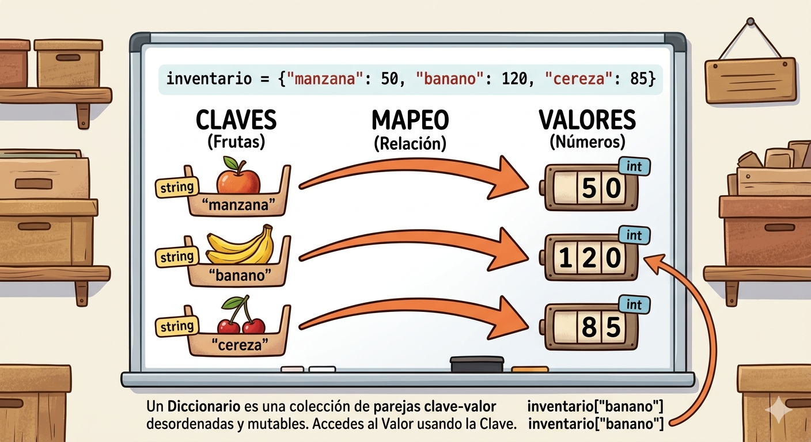

# DICCIONARIOS EN PYTHON
Conceptos y ejercicios de diccionarios en python

- Los diccionarios son datos estructurados, es decir, hacen referencia a una colección de datos.
- Son una colección desordenada de pares de datos de la forma **clave:valor**, conocidos como elementos o items.
- Son multiples, una vez definido se le pueden agregar nuevos elementos, modificar o eliminar algunos de los que ya tiene.
- Tambien son conocidos como arreglos asociativos.

## Representación gráfica de un diccionario


## Sintaxis

`nombre_diccionario = {clave1:valor1, clave2:valor2,...}`

- Cada item o elemento tiene la forma **clave:valor**
- En cada item hay una clave y uno o mas valores. Si se desconoce el valor, se puede completar con *None*
- Los elementos del diccionario se indexan por la clave.
- Las claves solo pueden ser datos inmutables.
- Los valores pueden ser datos mutables o inmutables.
- Las claves no pueden repetirse dentro de un diccionario.

### Ejemplo

`frutas = {'manzana':34, 'pera':45}`

## Operaciones

### Agregar elementos

`nombre_dicciorio[clave] = valor`

`frutas['cerveza'] = 90`

### Consultar o modificar elementos

`print('El valor de pera es : ', frutas['pera'])`

### Eliminar elementos

`del frutas['pera']`

### Operador de pertenencia

``` Py
if 'cereza' in frutas:
    print( si esta cereza en el diccionario)
else:
    print(No esta cereza en el diccionario)
```

## Ejercicio
Cree un programa en Python que utilice un diccionario para guardar los nombres de sus amigos y su telefono.  En este caso, el diccionario representa una agenda telefónica.  El programa pedirá nombres y telefonos y los irá guardando en el diccionario (los nombres en mayúscula).  Además, el programa debe permitir consultar o eliminar un telefono.  Incluya un menú de opciones.
